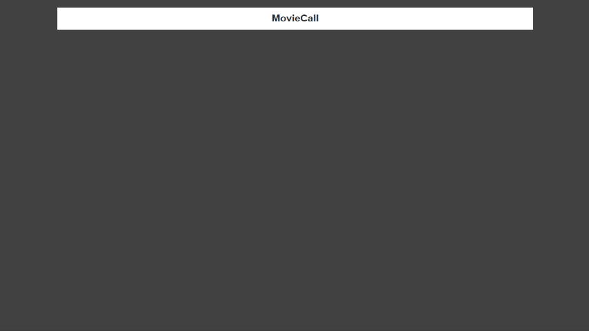

# Redux Asynchronous Simple Example

## Installation

~~~
  git clone https://github.com/HamSungJun/Redux-Async.git

  In Project root Directory/

    $ npm install
    $ npm run dev -> localhost:9000
~~~

## Description

>redux-thunk 모듈을 통해 상태관리 상황에서의 비동기 요청에 대처.

## Demo

## Why do we need synchronous loading process?

> 서버로부터의 HTTP request를 요청하는 상황에서 자바스크립트 코드는 비동기적으로 동작한다. 만약 서버로부터의 온전한 응답을 받기전에 렌더링이 시작된다면 아무런 데이터도 표시해 줄 수 없게 된다. 이를 해결하기 위해서는 다음과 같은 방법들이 존재한다.

1. setTimeout()메소드를 통해 일정시간 기다린후 렌더링.
  ~~~
  (Not Recommended)

  네트워크 상황은 예측할 수 없기때문에 일정 시간 기다리는 것은 퍼포먼스 하락을 야기하고 기다리는 일정시간 이후에도 응답이 올 수 있음.

  ~~~

2. redux-thunk 미들웨어와 fetch().then().catch() 메서드를 이용.

> 서버측의 응답을 온전히 받음을 보장받고 다음의 프로세스를 진행함.

~~~
[./Actions.js]

export const AC_FETCH_MOVIE_DATA_START = () =>{

  // 해당함수는 redux-thunk 미들웨어를 지나는중에 실행된다.
  return (dispatch,getState) => {

    // Fetching State를 변경하여 로딩화면을 렌더링.
    dispatch({

      type : A_FETCH_MOVIE_DATA_START,
      isFetching : true

    })

    // 서버쪽의 API를 호출.
    fetch("https://yts.am/api/v2/list_movies.json")
    .then(response => response.json())
    .then((response)=>{

      // 서버쪽의 응답을 온전하게 받고 JSON 오브젝트로 파싱완료된 상황.
      dispatch({
        type : A_FETCH_MOVIE_DATA_DONE,
        response : response.data.movies,
        isFetching : false
      })

    })
    .catch((error)=>{
      // 오류 상황 발생시 오류 메시지를 렌더링.
      dispatch({
        type : A_FETCH_MOVIE_DATA_ERROR,
        isFetching : false,
        error : error
      })

    })

  }

}
~~~

